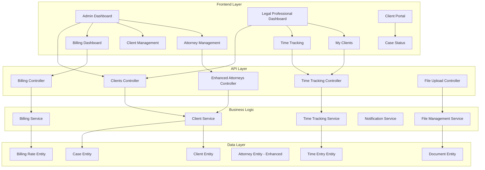

# Design Document

## Overview

The Cannlaw Client Management & Billing System extends the existing Cannlaw infrastructure with comprehensive case management, time tracking, and billing capabilities. The system maintains the existing role-based architecture while adding new entities for clients, cases, time entries, and enhanced attorney management.

## Architecture

### System Components



### Database Schema Extensions

The system extends the existing L4H database with new entities while maintaining compatibility with existing User and Attorney tables.

## Components and Interfaces

### 1. Enhanced Attorney Management

**Frontend Components:**
- `AttorneyManagementPage` - Enhanced with photo upload and full CRUD
- `AttorneyForm` - Form component with image upload capability
- `AttorneyCard` - Display component with photo and contact info

**Backend Components:**
- Enhanced `AttorneysController` with file upload endpoints
- `FileUploadService` for handling attorney photos
- Updated `Attorney` entity with photo URL and additional contact fields

### 2. Client Management System

**Frontend Components:**
- `ClientManagementPage` - Role-based client listing with search/filter
- `ClientProfilePage` - Comprehensive client details and case management
- `ClientSearchBar` - Advanced search with multiple filter criteria
- `ClientAssignmentModal` - Admin tool for assigning/reassigning clients

**Backend Components:**
- `ClientsController` - Full CRUD operations with role-based filtering
- `ClientService` - Business logic for client management and assignment
- `Client` entity with personal information and case details
- `Case` entity with status tracking and history

### 3. Time Tracking and Billing

**Frontend Components:**
- `TimeTrackingWidget` - 6-minute increment timer with start/stop functionality
- `TimeEntryList` - Display of recorded time entries with editing capability
- `BillingDashboard` - Admin view of all attorney billing information
- `BillingReportGenerator` - Export and reporting functionality

**Backend Components:**
- `TimeTrackingController` - Time entry CRUD operations
- `BillingController` - Billing calculations and reporting
- `TimeTrackingService` - Business logic for time calculations
- `BillingService` - Rate calculations and report generation
- `TimeEntry` entity with 6-minute increment validation
- `BillingRate` entity for configurable hourly rates

### 4. Document Management

**Frontend Components:**
- `DocumentUploadZone` - Drag-and-drop file upload interface
- `DocumentViewer` - Preview and download functionality
- `DocumentOrganizer` - Categorization and management tools

**Backend Components:**
- `DocumentsController` - File upload and management endpoints
- `DocumentService` - File processing and organization logic
- `Document` entity with metadata and categorization

## Data Models

### Client Entity
```csharp
public class Client
{
    public int Id { get; set; }
    public string FirstName { get; set; }
    public string LastName { get; set; }
    public string Email { get; set; }
    public string Phone { get; set; }
    public string Address { get; set; }
    public DateTime DateOfBirth { get; set; }
    public string CountryOfOrigin { get; set; }
    
    // Case Management
    public int? AssignedAttorneyId { get; set; }
    public Attorney AssignedAttorney { get; set; }
    public List<Case> Cases { get; set; }
    public List<Document> Documents { get; set; }
    public List<TimeEntry> TimeEntries { get; set; }
    
    // Audit Fields
    public DateTime CreatedAt { get; set; }
    public DateTime UpdatedAt { get; set; }
    public string CreatedBy { get; set; }
    public string UpdatedBy { get; set; }
}
```

### Case Entity
```csharp
public class Case
{
    public int Id { get; set; }
    public int ClientId { get; set; }
    public Client Client { get; set; }
    
    public string CaseType { get; set; } // Immigration type
    public CaseStatus Status { get; set; }
    public string Description { get; set; }
    public DateTime StartDate { get; set; }
    public DateTime? CompletionDate { get; set; }
    
    // Status tracking
    public List<CaseStatusHistory> StatusHistory { get; set; }
    public string Notes { get; set; }
    
    // Government interaction
    public string GovernmentCaseNumber { get; set; }
    public string RejectionReason { get; set; } // For closed cases
    
    public DateTime CreatedAt { get; set; }
    public DateTime UpdatedAt { get; set; }
}

public enum CaseStatus
{
    NotStarted,
    InProgress,
    Paid,
    FormsCompleted,
    Complete,
    ClosedRejected
}
```

### Time Entry Entity
```csharp
public class TimeEntry
{
    public int Id { get; set; }
    public int ClientId { get; set; }
    public Client Client { get; set; }
    public int AttorneyId { get; set; }
    public Attorney Attorney { get; set; }
    
    public DateTime StartTime { get; set; }
    public DateTime EndTime { get; set; }
    public decimal Duration { get; set; } // In 0.1 hour increments
    public string Description { get; set; }
    public string Notes { get; set; }
    
    // Billing
    public decimal HourlyRate { get; set; }
    public decimal BillableAmount { get; set; }
    public bool IsBilled { get; set; }
    public DateTime? BilledDate { get; set; }
    
    public DateTime CreatedAt { get; set; }
}
```

### Enhanced Attorney Entity
```csharp
public class Attorney // Extends existing
{
    // Existing fields...
    
    // New fields for enhanced management
    public string PhotoUrl { get; set; }
    public string DirectPhone { get; set; }
    public string DirectEmail { get; set; }
    public string OfficeLocation { get; set; }
    public decimal DefaultHourlyRate { get; set; }
    public bool IsActive { get; set; }
    
    // Navigation properties
    public List<Client> AssignedClients { get; set; }
    public List<TimeEntry> TimeEntries { get; set; }
    public List<BillingRate> BillingRates { get; set; }
}
```

### Document Entity
```csharp
public class Document
{
    public int Id { get; set; }
    public int ClientId { get; set; }
    public Client Client { get; set; }
    
    public string FileName { get; set; }
    public string OriginalFileName { get; set; }
    public string FileUrl { get; set; }
    public string ContentType { get; set; }
    public long FileSize { get; set; }
    
    public DocumentCategory Category { get; set; }
    public string Description { get; set; }
    public DateTime UploadDate { get; set; }
    public string UploadedBy { get; set; }
}

public enum DocumentCategory
{
    PersonalDocuments,
    GovernmentForms,
    SupportingEvidence,
    Correspondence,
    Legal,
    Other
}
```

## Error Handling

### Client Management Errors
- **Client Not Found**: Return 404 with clear message
- **Assignment Conflicts**: Validate attorney availability and workload
- **Status Transition Errors**: Enforce valid status progression rules
- **Search Timeout**: Handle large dataset searches with pagination

### Time Tracking Errors
- **Concurrent Sessions**: Prevent multiple active timers per attorney
- **Invalid Duration**: Validate 6-minute increment requirements
- **Billing Calculation Errors**: Handle rate changes and edge cases
- **Timer Persistence**: Recover from browser crashes or network issues

### File Upload Errors
- **File Size Limits**: Enforce maximum file sizes per document type
- **Invalid File Types**: Validate against allowed extensions
- **Storage Failures**: Handle cloud storage service interruptions
- **Virus Scanning**: Integrate security scanning for uploaded files

## Testing Strategy

### Unit Testing
- **Service Layer Tests**: Client assignment logic, billing calculations, time tracking
- **Entity Validation Tests**: Data model constraints and business rules
- **Controller Tests**: API endpoint behavior and authorization
- **Utility Tests**: File upload processing, search algorithms

### Integration Testing
- **Database Operations**: Entity relationships and complex queries
- **File Storage Integration**: Upload, retrieval, and deletion workflows
- **Email Notifications**: Assignment and status change notifications
- **Authentication Flow**: Role-based access control validation

### End-to-End Testing
- **Client Management Workflow**: Complete case lifecycle from assignment to completion
- **Time Tracking Scenarios**: Start/stop timer, billing calculation, report generation
- **Admin Operations**: Attorney management, client reassignment, billing oversight
- **Multi-user Scenarios**: Concurrent access and data consistency

### Performance Testing
- **Search Performance**: Large client database search and filtering
- **File Upload Performance**: Multiple concurrent document uploads
- **Billing Calculation Performance**: Complex time entry aggregations
- **Dashboard Load Times**: Real-time data updates and refresh rates

## Security Considerations

### Data Protection
- **Client Information Encryption**: Encrypt PII at rest and in transit
- **Document Security**: Secure file storage with access logging
- **Audit Trails**: Complete logging of all data modifications
- **GDPR Compliance**: Data retention policies and deletion capabilities

### Access Control
- **Role-Based Permissions**: Strict enforcement of admin vs. legal professional access
- **Client Data Isolation**: Legal professionals can only access assigned clients
- **API Security**: JWT token validation and refresh mechanisms
- **File Access Control**: Document access restricted to case participants

### Compliance
- **Legal Industry Standards**: Attorney-client privilege protection
- **Data Retention**: Configurable retention policies for different document types
- **Backup and Recovery**: Secure backup procedures with encryption
- **Incident Response**: Procedures for data breach detection and response

## Performance Optimization

### Database Optimization
- **Indexing Strategy**: Optimize queries for client search and time entry aggregation
- **Query Optimization**: Efficient joins for complex reporting queries
- **Caching Strategy**: Redis caching for frequently accessed client data
- **Connection Pooling**: Optimize database connection management

### Frontend Performance
- **Lazy Loading**: Load client lists and documents on demand
- **Virtual Scrolling**: Handle large client lists efficiently
- **Image Optimization**: Compress and resize attorney photos
- **Bundle Optimization**: Code splitting for different user roles

### File Management
- **Cloud Storage**: Utilize Azure Blob Storage for scalable document storage
- **CDN Integration**: Fast delivery of attorney photos and documents
- **Compression**: Automatic compression for uploaded documents
- **Thumbnail Generation**: Generate previews for image documents

## Deployment Considerations

### Database Migration
- **Schema Updates**: Add new tables while maintaining existing data
- **Data Migration**: Migrate existing attorney data to enhanced schema
- **Rollback Strategy**: Ability to revert schema changes if needed
- **Performance Impact**: Minimize downtime during migration

### Feature Rollout
- **Phased Deployment**: Roll out features incrementally
- **Feature Flags**: Enable/disable features for different user groups
- **User Training**: Documentation and training materials for new features
- **Monitoring**: Track feature adoption and performance metrics

### Infrastructure Requirements
- **Storage Scaling**: Plan for document storage growth
- **Compute Resources**: Additional resources for time tracking and billing calculations
- **Backup Strategy**: Enhanced backup procedures for client data
- **Monitoring**: Comprehensive monitoring for new services and endpoints