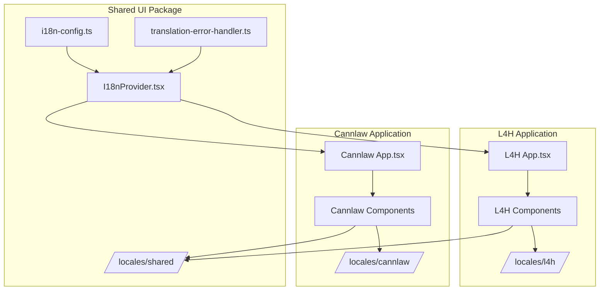
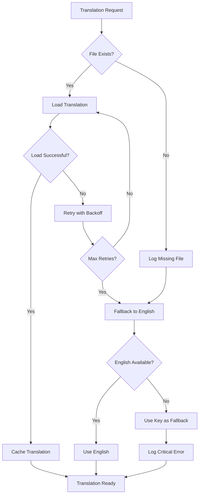

# Design Document

## Overview

This design addresses the comprehensive localization system issues across the L4H platform by establishing a unified, robust i18n architecture that works consistently across all applications (L4H, Cannlaw, shared-ui). The solution focuses on consolidating i18n instances, implementing complete translation coverage, establishing consistent patterns, and ensuring reliable fallback mechanisms.

## Architecture

### Core i18n System Architecture



### Translation Namespace Structure

```
shared/
├── common.json          # Shared UI elements, buttons, navigation
├── errors.json          # Error messages, validation
├── forms.json           # Form labels, placeholders, validation
└── auth.json           # Authentication flows

l4h/
├── interview.json       # Interview-specific content
├── dashboard.json       # L4H dashboard content
├── visa-library.json    # Visa information
└── pricing.json         # Pricing and packages

cannlaw/
├── legal.json          # Legal terminology
├── billing.json        # Billing and time tracking
├── clients.json        # Client management
└── cases.json          # Case management
```

## Components and Interfaces

### 1. Unified i18n Configuration

**Enhanced i18n-config.ts**
- Single source of truth for i18n configuration
- Consolidated plugin registration
- Unified namespace management
- Consistent error handling integration

```typescript
interface I18nConfig {
  supportedLanguages: string[]
  namespaces: {
    shared: string[]
    l4h: string[]
    cannlaw: string[]
  }
  fallbackChain: string[]
  loadingStrategy: 'lazy' | 'preload'
  errorHandling: ErrorHandlingConfig
}
```

### 2. Application-Specific i18n Providers

**L4H i18n Provider**
```typescript
interface L4HI18nProviderProps {
  children: ReactNode
  additionalNamespaces?: string[]
  preloadNamespaces?: string[]
}
```

**Cannlaw i18n Provider**
```typescript
interface CannlawI18nProviderProps {
  children: ReactNode
  additionalNamespaces?: string[]
  preloadNamespaces?: string[]
}
```

### 3. Translation Hook Interfaces

**Enhanced useTranslation Hook**
```typescript
interface UseTranslationOptions {
  namespace?: string | string[]
  fallbackNamespace?: string
  errorBoundary?: boolean
  suspense?: boolean
}

interface TranslationResult {
  t: TFunction
  i18n: i18n
  ready: boolean
  error: Error | null
}
```

### 4. Translation Management System

**Translation Validator**
```typescript
interface TranslationValidator {
  validateCompleteness(language: string): ValidationResult
  validateInterpolation(key: string, params: object): boolean
  validateRTLCompatibility(language: string): RTLValidationResult
  generateMissingKeysReport(): MissingKeysReport
}
```

## Data Models

### Translation File Structure

```typescript
interface TranslationFile {
  [key: string]: string | TranslationFile
}

interface TranslationMetadata {
  version: string
  lastUpdated: string
  completeness: number
  validator: string
}

interface LanguageBundle {
  translations: TranslationFile
  metadata: TranslationMetadata
  rtlSupport: boolean
}
```

### Error Tracking Models

```typescript
interface TranslationError {
  id: string
  timestamp: Date
  language: string
  namespace: string
  key: string
  errorType: 'missing_key' | 'loading_failed' | 'interpolation_error'
  context: string
  userAgent: string
  resolved: boolean
}

interface ErrorStatistics {
  totalErrors: number
  errorsByLanguage: Record<string, number>
  errorsByNamespace: Record<string, number>
  recentErrors: TranslationError[]
  resolutionRate: number
}
```

## Error Handling

### Translation Loading Error Handling



### Error Recovery Strategies

1. **Immediate Fallback**: Missing keys fall back to English immediately
2. **Retry with Backoff**: Failed loads retry with exponential backoff
3. **Graceful Degradation**: System continues functioning with available translations
4. **User Notification**: Non-intrusive notifications for fallback usage
5. **Administrative Alerts**: Critical errors trigger admin notifications

## Testing Strategy

### Unit Testing

1. **i18n Configuration Tests**
   - Plugin registration validation
   - Namespace loading verification
   - Error handling behavior

2. **Translation Hook Tests**
   - Hook behavior with valid/invalid keys
   - Namespace switching functionality
   - Error state management

3. **Component Integration Tests**
   - Translation rendering in components
   - RTL layout behavior
   - Language switching effects

### Integration Testing

1. **Cross-Application Translation Tests**
   - Shared translation consistency
   - Application-specific translation isolation
   - Namespace conflict resolution

2. **Error Handling Integration Tests**
   - End-to-end error recovery flows
   - Fallback system reliability
   - User notification behavior

3. **Performance Testing**
   - Translation loading performance
   - Memory usage optimization
   - Cache effectiveness

### End-to-End Testing

1. **User Journey Tests**
   - Complete user flows in multiple languages
   - Language switching during workflows
   - RTL language user experience

2. **Accessibility Testing**
   - Screen reader compatibility
   - Keyboard navigation in RTL
   - Language attribute correctness

## Implementation Phases

### Phase 1: Core Infrastructure Consolidation
- Unify i18n configuration across applications
- Implement shared translation loading system
- Establish consistent error handling

### Phase 2: Translation Coverage Implementation
- Audit and implement missing translation keys
- Establish translation key naming conventions
- Create application-specific translation files

### Phase 3: Error Handling and Monitoring
- Implement comprehensive error tracking
- Add user notification system
- Create administrative monitoring tools

### Phase 4: Performance and Quality Optimization
- Optimize translation loading performance
- Implement translation validation tools
- Add automated quality checks

### Phase 5: Testing and Documentation
- Comprehensive testing implementation
- Developer documentation creation
- User guide for multilingual features

## Migration Strategy

### Existing System Migration

1. **Gradual Migration Approach**
   - Maintain backward compatibility during transition
   - Migrate applications one at a time
   - Validate functionality at each step

2. **Translation Key Migration**
   - Map existing keys to new structure
   - Provide migration utilities
   - Validate key consistency

3. **Configuration Consolidation**
   - Merge existing i18n configurations
   - Resolve conflicts and inconsistencies
   - Test unified configuration

### Rollback Plan

1. **Configuration Rollback**
   - Maintain previous configuration as backup
   - Quick rollback mechanism for critical issues
   - Gradual rollforward after fixes

2. **Translation Rollback**
   - Version control for translation files
   - Ability to revert to previous translations
   - Selective rollback by language/namespace

## Monitoring and Maintenance

### Translation Health Monitoring

1. **Real-time Error Tracking**
   - Translation loading failures
   - Missing key occurrences
   - User fallback notifications

2. **Quality Metrics**
   - Translation completeness by language
   - User satisfaction with translations
   - Performance metrics for loading

3. **Administrative Dashboard**
   - Translation error statistics
   - Missing key reports
   - Language usage analytics

### Maintenance Procedures

1. **Regular Translation Audits**
   - Completeness verification
   - Quality assessment
   - Consistency checks

2. **Performance Optimization**
   - Cache effectiveness analysis
   - Loading time optimization
   - Bundle size management

3. **User Feedback Integration**
   - Translation quality feedback
   - Missing translation reports
   - Cultural adaptation requests

## Security Considerations

### Translation Security

1. **Input Sanitization**
   - Sanitize all translation interpolation values
   - Prevent XSS through translation content
   - Validate translation file integrity

2. **Access Control**
   - Secure translation file access
   - Administrative function protection
   - User preference security

3. **Data Privacy**
   - Language preference privacy
   - Error logging data protection
   - User activity anonymization

## Performance Considerations

### Loading Optimization

1. **Lazy Loading Strategy**
   - Load translations on demand
   - Preload critical namespaces
   - Cache frequently used translations

2. **Bundle Optimization**
   - Split translations by namespace
   - Compress translation files
   - Optimize network requests

3. **Memory Management**
   - Efficient translation storage
   - Garbage collection for unused translations
   - Memory leak prevention

## Accessibility Integration

### Multilingual Accessibility

1. **Language Attributes**
   - Proper HTML lang attributes
   - Dynamic language switching
   - Screen reader compatibility

2. **RTL Accessibility**
   - Keyboard navigation adaptation
   - Focus management in RTL
   - Assistive technology support

3. **Content Accessibility**
   - Alternative text translations
   - Form label translations
   - Error message accessibility