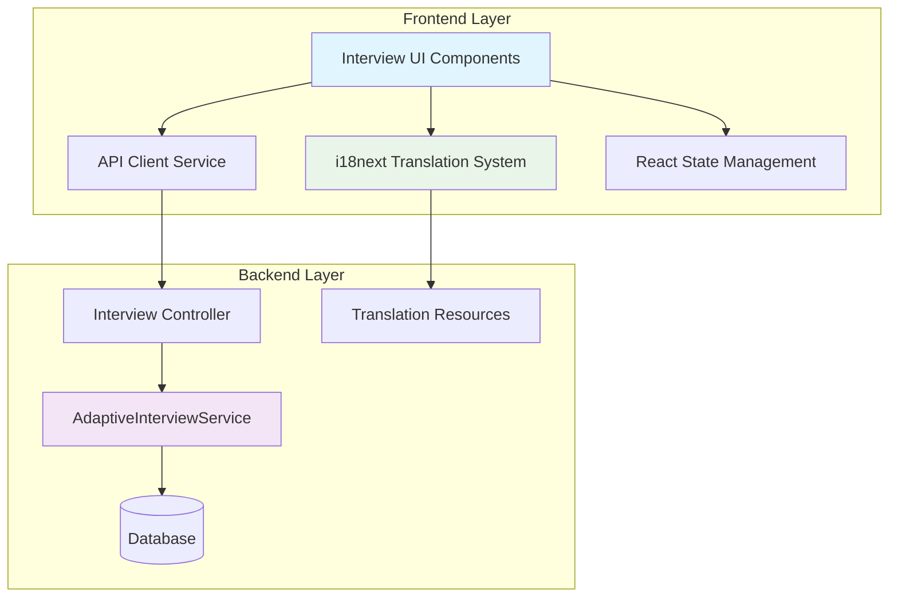

# Design Document

## Overview

This design addresses the critical issues in the L4H platform's interview system and localization by implementing a unified, API-driven architecture with comprehensive multilingual support. The solution eliminates the problematic dual-logic system (frontend DecisionEngine.js vs. backend API) and establishes a robust internationalization framework that supports all 21 target languages with proper RTL handling.

## Architecture

### Current State Analysis

**Problems Identified:**
1. **Split Interview Logic**: Legacy `DecisionEngine.js` conflicts with API-driven `AdaptiveInterviewService`
2. **Incomplete Localization**: Missing translations, hardcoded strings, broken i18n loading
3. **Inconsistent API Integration**: Wrong endpoints, missing auth headers, improper error handling
4. **Poor User Experience**: No progress indicators, unclear error messages, broken state management

**Root Causes:**
- Gradual migration from client-side to server-side logic left both systems active
- Localization was added as an afterthought without proper architecture
- Frontend components were built before i18n requirements were established
- API integration patterns were inconsistent across different components

### Target Architecture



## Components and Interfaces

### 1. Interview Service Layer (Backend)

**Enhanced AdaptiveInterviewService**
- **Purpose**: Single source of truth for all interview logic
- **Key Methods**:
  - `GetNextQuestionAsync()`: Returns next question based on user profile and answers
  - `ProcessAnswerAsync()`: Records answer and updates session state
  - `GetRecommendationAsync()`: Provides final visa recommendation
  - `ValidateCompletionAsync()`: Determines if interview can be completed

**Interview Controller Improvements**
- **Endpoints**:
  - `POST /api/v1/interview/start`: Initialize session with user profile data
  - `POST /api/v1/interview/answer`: Submit answer and get next question
  - `GET /api/v1/interview/status`: Get current session status and progress
  - `POST /api/v1/interview/reset`: Clear session and restart

### 2. Localization Infrastructure

**Translation Resource Structure**
```
/locales/
├── en-US/
│   ├── common.json
│   ├── interview.json
│   └── errors.json
├── fr-FR/
│   ├── common.json
│   ├── interview.json
│   └── errors.json
└── [other languages...]
```

**i18n Configuration**
- **Library**: i18next with react-i18next
- **Loading Strategy**: Lazy loading with fallbacks
- **Namespace Organization**: Separate namespaces for different feature areas
- **RTL Support**: Automatic direction detection and layout adjustment

### 3. Frontend Component Architecture

**InterviewPage Component**
```typescript
interface InterviewPageProps {
  sessionId?: string;
}

interface InterviewState {
  currentQuestion: AdaptiveQuestion | null;
  answers: Record<string, string>;
  progress: InterviewProgress;
  isLoading: boolean;
  error: string | null;
}
```

**Translation Hook Integration**
```typescript
const { t, i18n } = useTranslation(['interview', 'common']);

// Usage examples:
t('interview:title') // "Visa Eligibility Interview"
t('interview:progress.stats', { current: 3, remaining: 12 })
t('common:buttons.next') // "Next"
```

### 4. API Client Service

**Centralized API Communication**
```typescript
class InterviewApiClient {
  private baseURL = 'http://localhost:8765';
  private getAuthHeaders(): HeadersInit;
  
  async startInterview(caseId: string): Promise<InterviewSession>;
  async submitAnswer(sessionId: string, answer: InterviewAnswer): Promise<NextQuestionResponse>;
  async getProgress(sessionId: string): Promise<InterviewProgress>;
  async resetInterview(sessionId: string): Promise<void>;
}
```

## Data Models

### Interview Question Model
```typescript
interface AdaptiveQuestion {
  key: string;
  question: string;
  type: 'single_choice' | 'multiple_choice' | 'text' | 'number';
  options?: InterviewOption[];
  required: boolean;
  remainingVisaTypes: number;
  remainingVisaCodes: string[];
  metadata?: {
    category: string;
    difficulty: number;
    estimatedTime: number;
  };
}
```

### Translation Resource Model
```typescript
interface TranslationResource {
  interview: {
    title: string;
    loading: string;
    progress: {
      title: string;
      stats: string; // "Question {{current}} | {{remaining}} visa types remaining"
    };
    buttons: {
      next: string;
      previous: string;
      restart: string;
      complete: string;
    };
    messages: {
      selectOption: string;
      required: string;
      completed: string;
    };
  };
}
```

### Interview Progress Model
```typescript
interface InterviewProgress {
  sessionId: string;
  currentQuestionNumber: number;
  totalQuestionsAnswered: number;
  remainingVisaTypes: number;
  estimatedQuestionsRemaining: number;
  completionPercentage: number;
}
```

## Error Handling

### Error Categories and Responses

**1. Translation Loading Errors**
- **Fallback Strategy**: Load English as backup, continue with functionality
- **User Experience**: Show language selection with warning about fallback
- **Logging**: Record failed language loads for monitoring

**2. API Communication Errors**
- **Network Timeouts**: Retry with exponential backoff, show retry button
- **Authentication Errors**: Redirect to login with return URL
- **Server Errors**: Show user-friendly message with support contact

**3. Interview Session Errors**
- **Invalid Session**: Guide user to restart interview
- **Corrupted State**: Offer to reset with progress warning
- **Completion Errors**: Allow manual completion with admin notification

### Error Message Localization
```typescript
interface ErrorMessages {
  network: {
    timeout: string;
    offline: string;
    serverError: string;
  };
  interview: {
    sessionExpired: string;
    invalidAnswer: string;
    completionFailed: string;
  };
  translation: {
    loadFailed: string;
    fallbackActive: string;
  };
}
```

## Testing Strategy

### Unit Testing Approach

**Backend Service Tests**
- **AdaptiveInterviewService**: Test question filtering logic with various user profiles
- **Translation Loading**: Verify all language files load correctly
- **API Endpoints**: Test all interview endpoints with different scenarios

**Frontend Component Tests**
- **InterviewPage**: Test rendering with different question types and languages
- **Translation Integration**: Verify t() function calls work with all namespaces
- **Error Handling**: Test component behavior with various error states

### Integration Testing

**End-to-End Interview Flows**
- Complete interview in each supported language
- Test language switching mid-interview
- Verify RTL layout for Arabic and Urdu
- Test error recovery scenarios

**API Integration Tests**
- Test complete interview flow through API endpoints
- Verify authentication and session management
- Test concurrent interview sessions

### Localization Testing

**Translation Quality Assurance**
- Automated checks for missing translation keys
- Placeholder interpolation testing for all languages
- RTL layout verification
- Cultural appropriateness review for each language

**Performance Testing**
- Translation loading performance with large language files
- Memory usage with multiple languages loaded
- API response times under load

## Implementation Phases

### Phase 1: Backend Interview Service Cleanup
1. Remove all references to `DecisionEngine.js` and `routing_questions.csv`
2. Enhance `AdaptiveInterviewService` with robust filtering logic
3. Implement comprehensive error handling in interview endpoints
4. Add detailed logging for debugging interview flows

### Phase 2: Localization Infrastructure
1. Set up proper i18n configuration with namespace support
2. Create translation files for all 21 languages
3. Implement RTL support with automatic detection
4. Add translation loading error handling and fallbacks

### Phase 3: Frontend Component Refactoring
1. Remove all hardcoded strings from interview components
2. Implement proper translation key usage throughout
3. Add progress indicators and improved UX elements
4. Integrate centralized API client service

### Phase 4: Testing and Quality Assurance
1. Implement comprehensive test suites for all components
2. Conduct end-to-end testing in all supported languages
3. Performance testing and optimization
4. User acceptance testing with native speakers

## Security Considerations

### Authentication and Authorization
- All interview endpoints require valid JWT tokens
- Session validation prevents unauthorized access to interview data
- Rate limiting prevents abuse of interview endpoints

### Data Protection
- Interview answers are encrypted in transit and at rest
- Session data has appropriate expiration times
- User profile data access is properly scoped

### Input Validation
- All user inputs are validated and sanitized
- Translation keys are validated to prevent injection attacks
- API parameters are properly typed and validated

## Performance Considerations

### Translation Loading Optimization
- Lazy loading of translation files reduces initial bundle size
- Caching strategies for frequently accessed translations
- Compression of translation files for faster loading

### API Response Optimization
- Efficient database queries for visa filtering logic
- Response caching for static interview questions
- Pagination for large option lists

### Frontend Performance
- React component optimization with proper memoization
- Efficient state management to prevent unnecessary re-renders
- Progressive loading of interview content

## Monitoring and Observability

### Key Metrics
- Interview completion rates by language
- Translation loading success rates
- API response times and error rates
- User session duration and abandonment points

### Logging Strategy
- Structured logging for interview progression
- Error tracking with context for debugging
- Performance metrics collection
- User behavior analytics for UX improvements

## Migration Strategy

### Backward Compatibility
- Gradual rollout with feature flags
- Fallback mechanisms for legacy interview sessions
- Data migration for existing interview progress

### Rollback Plan
- Database backup before migration
- Feature flag controls for quick rollback
- Monitoring alerts for critical issues
- Communication plan for user impact