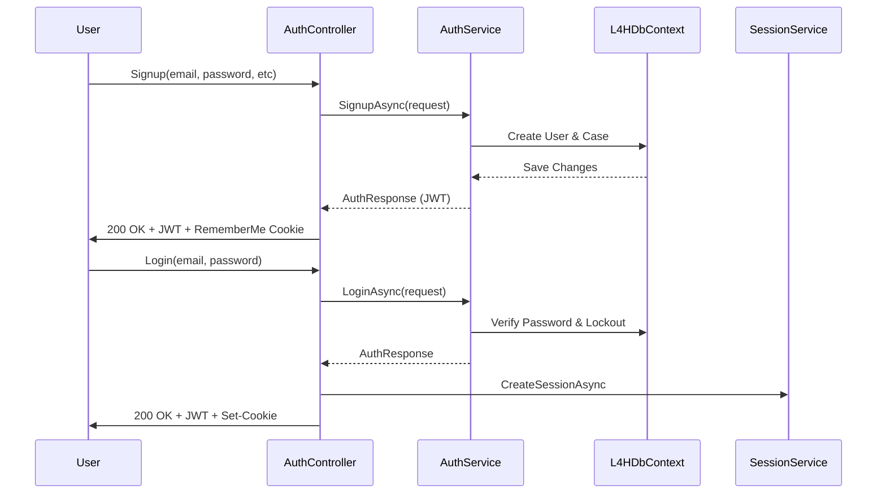
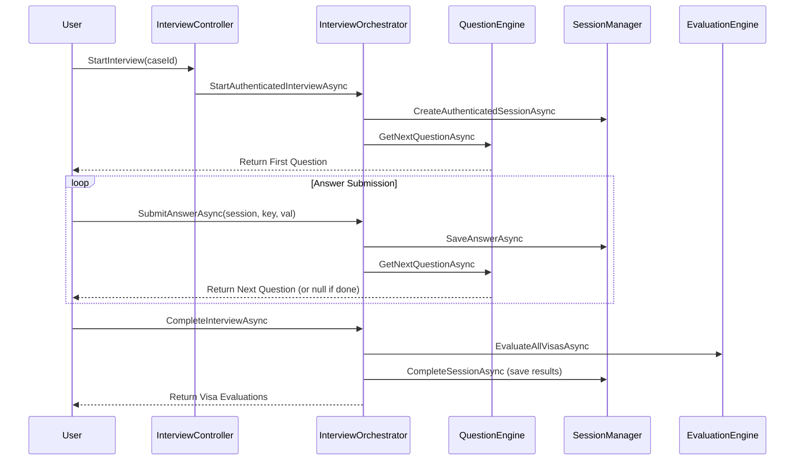

# L4HProject: Current State Specification Document
**Date:** February 11, 2026  
**Auditor:** Senior Systems Architect (Forensic Audit)

---

## 1. System Topology

The L4HProject is a distributed system utilizing a .NET 10 backend and a React-based frontend ecosystem. The project follows a service-oriented architecture with a clear separation between the API entry points, infrastructure, and specialized workers.

### Physical Project Structure
- **Backend (`/src`)**
    - `L4H.Api`: The primary ASP.NET Core REST API. Handles authentication, business logic orchestration, and client requests.
    - `L4H.Infrastructure`: The heart of the system. Contains Entity Framework Core (`L4HDbContext`), entity definitions, migrations, and shared business services.
    - `L4H.Shared`: Contains shared DTOs, value objects (e.g., `UserId`, `CaseId`), and common models used by both the Api and other backend projects.
    - `L4H.ScraperWorker`: A background service dedicated to data ingestion and workflow scraping.
    - `L4H.UploadGateway`: A specialized microservice for handling file uploads, bypasses the main API to manage large streams directly.
- **Frontend (`/web`)**
    - `l4h`: The primary client application (Vite + React + TypeScript).
    - `cannlaw`: A specialized attorney portal application.
    - `shared-ui`: A shared library of React components and API clients used by both frontends.

### Project References
- `L4H.Api` → `L4H.Infrastructure`, `L4H.Shared`
- `L4H.Infrastructure` → `L4H.Shared`
- `L4H.ScraperWorker` → `L4H.Infrastructure`
- `web/l4h` & `web/cannlaw` → `web/shared-ui` (via local file link)

---

## 2. Dependency Graph

### Internal Dependencies
- **Shared Library:** `L4H.Shared` is highly coupled with almost every backend component, defining the identity of core domain objects.
- **Infrastructure:** `L4H.Infrastructure` is the provider for all persistence and external service integrations (Mail, Payments, Graph).

### External Dependencies (.NET Backend)
- **Database:** `Microsoft.EntityFrameworkCore.SqlServer` (v10.0.3)
- **Identity/Security:** `Microsoft.AspNetCore.Authentication.JwtBearer`, `FluentValidation.AspNetCore`
- **External Integration:** `Microsoft.Graph` (v5.95.0), `Scalar.AspNetCore` (OpenAPI)
- **Utilities:** `Serilog`, `SixLabors.ImageSharp`, `CsvHelper`

### External Dependencies (React Frontend)
- **Framework:** `React` (v18.2.0), `React Router Dom` (v6.20.1)
- **State Management:** `@tanstack/react-query` (v5.87.1)
- **Forms & Validation:** `react-hook-form` (v7.48.2), `zod` (v3.22.4)
- **Styling:** `tailwindcss` (v3.3.6), `lucide-react` (v0.542.0)

---

## 3. Core Data Models & State

### User (Database: `Users` Table)
Represents identity, roles, and profile state.
- **Identity:** `UserId` (Guid), `Email`, `PasswordHash`.
- **Roles:** `IsAdmin`, `IsStaff`, `IsLegalProfessional`.
- **State:** `EmailVerified`, `IsActive`, `FailedLoginCount`, `LockoutUntil`.
- **Associations:** 
    - `AttorneyProfileId` (Self-reference if user is an attorney).
    - `AssignedAttorneyId` (Link to the lawyer handling their case).
- **Navigation:** Deeply coupled to `Cases`, `InterviewSessions`, `Documents`, `Messages`.

### Interview Session (Database: `InterviewSessions` Table)
Represents the state of a visa eligibility questionnaire.
- **Identifiers:** `Id` (Guid), `AnonymousToken` (Guid, for unauthenticated users).
- **State:** `Status` (active, completed, cancelled), `StartedAt`, `FinishedAt`.
- **Data Persistence:** 
    - `QAs`: List of `InterviewQA` entities (QuestionKey/AnswerValue pairs).
    - `VisaEligibilityResults`: Persisted results of the evaluation engine.

---

## 4. Sequential Workflows

### User Onboarding & Login

### The Interview Lifecycle

### Data Persistence
Data is persisted via EF Core using the Unit of Work pattern implicitly within Services.
- **When:** Every significant state change (Signup, Answer Submission, Session Completion, Profile Update).
- **How:** Direct `SaveChangesAsync()` calls in service methods (e.g., `AuthService`, `InterviewOrchestrator`).

---

## 5. Side Effects & Automation

- **`NotificationBackgroundService`:** 
    - Runs every 5 minutes.
    - Processes pending email notifications in the database queue.
    - Cleans up expired notifications.
- **`DailyDigestService`:** 
    - Runs every 30 minutes.
    - Aggregates messages from the last 24 hours into `DailyDigestQueue`.
    - Sends summarized email digests to users.
- **`RetentionBackgroundService`:** 
    - Handles data retention policies and periodic cleanup of stale sessions.
- **`CaseAutoAgingService`:** 
    - (Implied by filename) Likely updates case statuses based on inactivity or deadlines.

---

## 6. The 'Pain Point' Ledger

| Pain Point | Evidence in Code | Impact |
| :--- | :--- | :--- |
| **Logic Duplication** | `UploadsController` (Api) and `UploadGateway` (Program.cs) both implement file validation and token checking. | High maintenance risk; security rules must be updated in two places. |
| **God Objects** | `User.cs` and `InterviewSession.cs` have 20+ navigation properties and are referenced by almost every service. | Hard to refactor; potential performance issues with large object graphs. |
| **Fragile Flow Logic** | Interview progression depends on `string` keys (e.g., `questionKey.StartsWith("checklist_")`). | Brittle; renaming a question key in the DB can break the backend logic. |
| **Architectural Debt** | Presence of multiple `.Legacy.cs.bak` files for Interview and Eligibility services. | High cognitive load for developers; "shadow" logic paths may still exist. |
| **Tight Coupling** | `AuthService` explicitly creates a `Case` entity during signup. | Violates Single Responsibility; user creation is coupled with the case management domain. |
| **Data Inconsistency** | `DailyDigestService` stores aggregated data in `ItemsJson` (text field) instead of a structured relation. | Difficult to query or report on pending digest data. |
