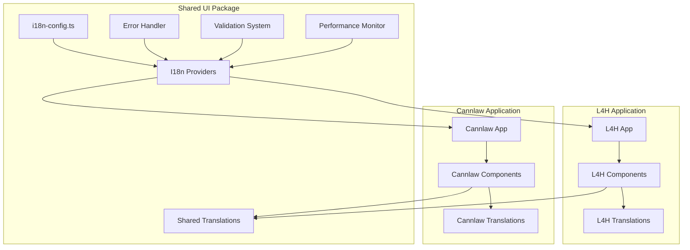

# i18n System Developer Guide

This comprehensive guide covers the unified internationalization (i18n) system for the L4H platform, including L4H, Cannlaw, and shared-ui components.

## Table of Contents

1. [Overview](#overview)
2. [Architecture](#architecture)
3. [Getting Started](#getting-started)
4. [Translation Management](#translation-management)
5. [Component Integration](#component-integration)
6. [Error Handling](#error-handling)
7. [Performance Optimization](#performance-optimization)
8. [Testing](#testing)
9. [Troubleshooting](#troubleshooting)
10. [Best Practices](#best-practices)

## Overview

The L4H platform supports 21 languages with comprehensive RTL (Right-to-Left) support, robust error handling, and performance optimization. The system is built on react-i18next with custom enhancements for enterprise-level reliability.

### Supported Languages

| Code | Language | Native Name | Script | Direction | Status |
|------|----------|-------------|--------|-----------|--------|
| en-US | English | English | Latin | LTR | ✅ Complete |
| es-ES | Spanish | Español | Latin | LTR | ✅ Complete |
| fr-FR | French | Français | Latin | LTR | ✅ Complete |
| de-DE | German | Deutsch | Latin | LTR | ✅ Complete |
| ar-SA | Arabic | العربية | Arabic | RTL | ✅ Complete |
| ur-PK | Urdu | اردو | Arabic | RTL | ✅ Complete |
| zh-CN | Chinese | 简体中文 | CJK | LTR | ✅ Complete |
| hi-IN | Hindi | हिन्दी | Devanagari | LTR | ✅ Complete |
| ja-JP | Japanese | 日本語 | CJK/Kana | LTR | ✅ Complete |
| ko-KR | Korean | 한국어 | Hangul | LTR | ✅ Complete |
| ru-RU | Russian | Русский | Cyrillic | LTR | ✅ Complete |
| pt-BR | Portuguese | Português | Latin | LTR | ✅ Complete |
| it-IT | Italian | Italiano | Latin | LTR | ✅ Complete |
| pl-PL | Polish | Polski | Latin | LTR | ✅ Complete |
| id-ID | Indonesian | Bahasa Indonesia | Latin | LTR | ✅ Complete |
| bn-BD | Bengali | বাংলা | Bengali | LTR | ✅ Complete |
| ta-IN | Tamil | தமிழ் | Tamil | LTR | ✅ Complete |
| te-IN | Telugu | తెలుగు | Telugu | LTR | ✅ Complete |
| mr-IN | Marathi | मराठी | Devanagari | LTR | ✅ Complete |
| tr-TR | Turkish | Türkçe | Latin | LTR | ✅ Complete |
| vi-VN | Vietnamese | Tiếng Việt | Latin | LTR | ✅ Complete |

## Architecture

### System Components



### Translation Namespace Structure

```
web/shared-ui/public/locales/shared/{language}/
├── common.json          # Shared UI elements, buttons, navigation
├── errors.json          # Error messages, validation
├── forms.json           # Form labels, placeholders, validation
└── auth.json           # Authentication flows

web/l4h/public/locales/l4h/{language}/
├── interview.json       # Interview-specific content
├── dashboard.json       # L4H dashboard content
├── visa-library.json    # Visa information
└── pricing.json         # Pricing and packages

web/cannlaw/public/locales/cannlaw/{language}/
├── legal.json          # Legal terminology
├── billing.json        # Billing and time tracking
├── clients.json        # Client management
└── cases.json          # Case management
```

## Getting Started

### Installation

The i18n system is already integrated into the shared-ui package. No additional installation is required.

### Basic Setup

#### 1. Application Setup

For L4H application:

```typescript
// web/l4h/src/App.tsx
import { L4HI18nProvider } from '@shared-ui/providers/L4HI18nProvider'

function App() {
  return (
    <L4HI18nProvider>
      <YourAppComponents />
    </L4HI18nProvider>
  )
}
```

For Cannlaw application:

```typescript
// web/cannlaw/src/App.tsx
import { CannlawI18nProvider } from '@shared-ui/providers/CannlawI18nProvider'

function App() {
  return (
    <CannlawI18nProvider>
      <YourAppComponents />
    </CannlawI18nProvider>
  )
}
```

#### 2. Component Usage

```typescript
import { useTranslation } from 'react-i18next'

function MyComponent() {
  const { t, i18n } = useTranslation(['common', 'forms'])
  
  return (
    <div>
      <h1>{t('common.welcome', 'Welcome')}</h1>
      <button onClick={() => i18n.changeLanguage('es-ES')}>
        {t('common.switchToSpanish', 'Switch to Spanish')}
      </button>
    </div>
  )
}
```

#### 3. RTL Support

RTL languages are automatically detected and applied:

```typescript
import { useRTL } from '@shared-ui/hooks/useRTL'

function RTLAwareComponent() {
  const { isRTL, direction } = useRTL()
  
  return (
    <div dir={direction} className={isRTL ? 'rtl-layout' : 'ltr-layout'}>
      <p>{t('common.content', 'Content')}</p>
    </div>
  )
}
```

## Translation Management

### Adding New Translation Keys

#### 1. Identify the Correct Namespace

- **Shared content**: Use `shared` namespace (common.json, errors.json, forms.json, auth.json)
- **L4H-specific**: Use `l4h` namespace (interview.json, dashboard.json, visa-library.json, pricing.json)
- **Cannlaw-specific**: Use `cannlaw` namespace (legal.json, billing.json, clients.json, cases.json)

#### 2. Add Translation Keys

```json
// web/shared-ui/public/locales/shared/en-US/common.json
{
  "navigation": {
    "home": "Home",
    "about": "About",
    "contact": "Contact"
  },
  "buttons": {
    "save": "Save",
    "cancel": "Cancel",
    "submit": "Submit"
  }
}
```

#### 3. Use Translation Keys in Components

```typescript
function NavigationComponent() {
  const { t } = useTranslation('common')
  
  return (
    <nav>
      <a href="/">{t('navigation.home')}</a>
      <a href="/about">{t('navigation.about')}</a>
      <a href="/contact">{t('navigation.contact')}</a>
    </nav>
  )
}
```

### Adding New Languages

Use the automated script to add new languages:

```bash
# Add a new language
cd web/shared-ui
npm run add-language -- --language pt-PT --name "Portuguese (Portugal)"

# This will:
# 1. Create translation files for all namespaces
# 2. Update language configuration
# 3. Add RTL support if needed
# 4. Update browser configurations for testing
```

### Translation Validation

Run validation to ensure translation completeness:

```bash
# Validate all translations
npm run validate-translations

# Validate specific language
npm run validate-translations -- --language es-ES

# Check for missing keys
npm run check-missing-keys

# Validate interpolation consistency
npm run validate-interpolation
```

## Component Integration

### Using Translations in Components

#### Basic Usage

```typescript
import { useTranslation } from 'react-i18next'

function BasicComponent() {
  const { t } = useTranslation('common')
  
  return (
    <div>
      <h1>{t('title', 'Default Title')}</h1>
      <p>{t('description', 'Default description')}</p>
    </div>
  )
}
```

#### Multiple Namespaces

```typescript
function MultiNamespaceComponent() {
  const { t } = useTranslation(['common', 'forms', 'errors'])
  
  return (
    <form>
      <label>{t('forms.email', 'Email')}</label>
      <input type="email" placeholder={t('forms.emailPlaceholder', 'Enter your email')} />
      {error && <span className="error">{t('errors.invalidEmail', 'Invalid email')}</span>}
      <button type="submit">{t('common.submit', 'Submit')}</button>
    </form>
  )
}
```

#### Interpolation

```typescript
function InterpolationComponent({ userName, itemCount }) {
  const { t } = useTranslation('common')
  
  return (
    <div>
      <h1>{t('welcome', 'Welcome, {{name}}!', { name: userName })}</h1>
      <p>{t('itemCount', 'You have {{count}} items', { count: itemCount })}</p>
      <p>{t('itemCountPlural', 'You have {{count}} item', 'You have {{count}} items', { count: itemCount })}</p>
    </div>
  )
}
```

### Enhanced Hooks

#### useFallbackTranslation

For critical UI elements that must always display text:

```typescript
import { useFallbackTranslation } from '@shared-ui/hooks/useFallbackTranslation'

function CriticalComponent() {
  const { safeT, isUsingFallback } = useFallbackTranslation()
  
  return (
    <div>
      {isUsingFallback && (
        <div className="fallback-notice">
          Using fallback translations
        </div>
      )}
      <h1>{safeT('common.criticalTitle', 'Critical Title')}</h1>
    </div>
  )
}
```

#### useTranslationLoader

For components that need to load additional translations:

```typescript
import { useTranslationLoader } from '@shared-ui/hooks/useTranslationLoader'

function DynamicComponent() {
  const {
    isLoading,
    hasError,
    loadTranslations,
    retryFailedNamespaces
  } = useTranslationLoader({
    language: 'es-ES',
    namespaces: ['dynamic-content'],
    loadPath: '/locales/{{lng}}/{{ns}}.json'
  })
  
  if (isLoading) return <div>Loading translations...</div>
  if (hasError) return <button onClick={retryFailedNamespaces}>Retry</button>
  
  return <div>Dynamic content loaded</div>
}
```

## Error Handling

### Automatic Error Handling

The system automatically handles translation errors with:

1. **Retry Logic**: Failed loads are retried with exponential backoff
2. **Fallback System**: Falls back to English when translations fail
3. **User Notifications**: Non-intrusive notifications inform users
4. **Graceful Degradation**: App continues functioning with available translations

### Manual Error Handling

```typescript
import { useTranslationErrorHandling } from '@shared-ui/hooks/useTranslationErrorHandling'

function ComponentWithErrorHandling() {
  const {
    hasErrors,
    isFallbackActive,
    retry,
    showNotification,
    dismissNotification
  } = useTranslationErrorHandling('es-ES', 'interview')
  
  return (
    <div>
      {hasErrors && (
        <div className="error-banner">
          <p>Translation loading failed</p>
          <button onClick={retry}>Retry</button>
        </div>
      )}
      {isFallbackActive && (
        <div className="fallback-banner">
          <p>Using English translations</p>
          <button onClick={dismissNotification}>Dismiss</button>
        </div>
      )}
      <YourContent />
    </div>
  )
}
```

### Error Monitoring

Monitor translation health with the monitoring dashboard:

```typescript
import { TranslationMonitoringDashboard } from '@shared-ui/components/TranslationMonitoringDashboard'

function AdminPanel() {
  return (
    <TranslationMonitoringDashboard
      languages={['en-US', 'es-ES', 'fr-FR']}
      namespaces={['common', 'errors', 'forms']}
      refreshInterval={30000}
    />
  )
}
```

## Performance Optimization

### Lazy Loading

Translations are loaded on-demand to optimize performance:

```typescript
// Preload critical namespaces
import { translationLoader } from '@shared-ui/services/TranslationLoader'

// In your app initialization
await translationLoader.preloadNamespaces('es-ES', ['common', 'errors'])
```

### Caching

The system automatically caches translations:

```typescript
// Cache management
import { TranslationCacheManager } from '@shared-ui/services/TranslationCacheManager'

const cacheManager = new TranslationCacheManager()

// Clear cache if needed
cacheManager.clearCache()

// Get cache statistics
const stats = cacheManager.getCacheStats()
console.log(`Cache hit rate: ${stats.hitRate}%`)
```

### Bundle Optimization

Optimize translation bundles:

```bash
# Compress translation files
npm run compress-translations

# Analyze bundle sizes
npm run analyze-translation-bundles

# Optimize network requests
npm run optimize-translation-loading
```

## Testing

### Unit Testing

Test translation functionality:

```typescript
import { renderWithI18n } from '@shared-ui/test-utils'
import { screen } from '@testing-library/react'

test('renders translated content', () => {
  renderWithI18n(<MyComponent />, { language: 'es-ES' })
  
  expect(screen.getByText('Bienvenido')).toBeInTheDocument()
})

test('handles missing translations', () => {
  renderWithI18n(<MyComponent />, { 
    language: 'es-ES',
    missingKeys: ['common.title']
  })
  
  // Should fall back to English
  expect(screen.getByText('Welcome')).toBeInTheDocument()
})
```

### Integration Testing

Test translation loading and error handling:

```typescript
import { translationLoader } from '@shared-ui/services/TranslationLoader'

test('loads translations with retry', async () => {
  const result = await translationLoader.loadTranslation({
    language: 'es-ES',
    namespace: 'common',
    loadPath: '/locales/{{lng}}/{{ns}}.json',
    maxRetries: 3
  })
  
  expect(result.success).toBe(true)
  expect(result.data).toHaveProperty('welcome')
})
```

### E2E Testing

Run comprehensive multilingual tests:

```bash
# Run multilingual e2e tests
npm run test:multilingual

# Test specific languages
npm run test:multilingual -- --languages en-US,es-ES,ar-SA

# Test RTL languages
npm run test:multilingual -- --languages ar-SA,ur-PK
```

## Troubleshooting

### Common Issues

#### Translations Not Loading

**Symptoms**: Components show translation keys instead of translated text

**Solutions**:
1. Check network connectivity
2. Verify translation file paths
3. Check browser console for errors
4. Validate JSON syntax in translation files

```bash
# Debug translation loading
npm run debug-translations -- --language es-ES --namespace common
```

#### RTL Layout Issues

**Symptoms**: RTL languages display incorrectly

**Solutions**:
1. Ensure RTL CSS is loaded
2. Check `dir` attribute on HTML elements
3. Verify RTL-specific styles

```typescript
// Debug RTL
import { useRTL } from '@shared-ui/hooks/useRTL'

function DebugRTL() {
  const { isRTL, direction } = useRTL()
  console.log('RTL Debug:', { isRTL, direction })
  return null
}
```

#### Performance Issues

**Symptoms**: Slow language switching or page loads

**Solutions**:
1. Check cache hit rates
2. Optimize translation bundle sizes
3. Preload critical namespaces

```bash
# Analyze performance
npm run analyze-translation-performance
```

#### Missing Translation Keys

**Symptoms**: Some text not translated in specific languages

**Solutions**:
1. Run translation validation
2. Check for typos in translation keys
3. Verify namespace loading

```bash
# Find missing keys
npm run find-missing-keys -- --language es-ES
```

### Debug Mode

Enable debug mode for detailed logging:

```typescript
// In development
if (process.env.NODE_ENV === 'development') {
  import('@shared-ui/i18n-config').then(({ enableDebugMode }) => {
    enableDebugMode()
  })
}
```

### Support Tools

#### Translation Validation

```bash
# Comprehensive validation
npm run validate-all-translations

# Specific validations
npm run validate-interpolation
npm run validate-completeness
npm run validate-consistency
```

#### Performance Monitoring

```bash
# Monitor translation performance
npm run monitor-translation-performance

# Generate performance report
npm run generate-performance-report
```

## Best Practices

### Development

1. **Always Provide Fallbacks**: Include default text for all translation keys
2. **Use Semantic Keys**: Create meaningful, hierarchical translation keys
3. **Validate Early**: Run translation validation during development
4. **Test RTL**: Always test Arabic or Urdu for RTL validation
5. **Monitor Performance**: Track translation loading performance

### Translation Keys

```typescript
// ✅ Good: Semantic, hierarchical keys
t('dashboard.user.profile.edit', 'Edit Profile')
t('forms.validation.email.required', 'Email is required')

// ❌ Bad: Generic, flat keys
t('button1', 'Edit Profile')
t('error', 'Email is required')
```

### Component Design

```typescript
// ✅ Good: Proper namespace usage
function UserProfile() {
  const { t } = useTranslation(['common', 'forms'])
  
  return (
    <div>
      <h1>{t('common.profile.title', 'User Profile')}</h1>
      <form>
        <label>{t('forms.email.label', 'Email')}</label>
        <input placeholder={t('forms.email.placeholder', 'Enter email')} />
      </form>
    </div>
  )
}

// ❌ Bad: Mixed namespaces, no fallbacks
function UserProfile() {
  const { t } = useTranslation()
  
  return (
    <div>
      <h1>{t('title')}</h1>
      <form>
        <label>{t('forms.email')}</label>
        <input placeholder={t('email_placeholder')} />
      </form>
    </div>
  )
}
```

### Performance

1. **Preload Critical Namespaces**: Load `common` and `errors` first
2. **Use Lazy Loading**: Load additional namespaces on demand
3. **Cache Effectively**: Leverage built-in caching mechanisms
4. **Monitor Bundle Sizes**: Keep translation files reasonably sized
5. **Optimize Network Requests**: Minimize translation loading requests

### Accessibility

1. **Language Attributes**: Ensure proper `lang` attributes
2. **Screen Reader Support**: Test with screen readers
3. **RTL Navigation**: Verify keyboard navigation in RTL
4. **Focus Management**: Ensure proper focus handling
5. **ARIA Labels**: Translate ARIA labels and descriptions

### Maintenance

1. **Regular Audits**: Periodically audit translation completeness
2. **Performance Monitoring**: Track performance metrics
3. **User Feedback**: Collect feedback on translation quality
4. **Version Control**: Track translation changes
5. **Documentation**: Keep documentation updated

## API Reference

### Core Functions

#### useTranslation
```typescript
const { t, i18n, ready } = useTranslation(namespace?, options?)
```

#### useFallbackTranslation
```typescript
const { safeT, isUsingFallback, fallbackState } = useFallbackTranslation(options?)
```

#### useTranslationLoader
```typescript
const { isLoading, hasError, loadTranslations, retryFailedNamespaces } = useTranslationLoader(options)
```

#### useTranslationErrorHandling
```typescript
const { hasErrors, isFallbackActive, retry, showNotification } = useTranslationErrorHandling(language, namespace)
```

### Services

#### TranslationLoader
```typescript
const result = await translationLoader.loadTranslation(options)
const results = await translationLoader.preloadNamespaces(language, namespaces, loadPath)
```

#### TranslationValidator
```typescript
const result = translationValidator.validateCompleteness(translations, reference, language)
const report = translationValidator.generateCompletenessReport(translations, reference, language)
```

### Components

#### TranslationErrorNotification
```typescript
<TranslationErrorNotification
  language={string}
  namespaces={string[]}
  autoRetry={boolean}
  maxAutoRetries={number}
  showFallbackOptions={boolean}
  position="top-right" | "top-left" | "bottom-right" | "bottom-left"
  onRetry={(lang, namespaces) => Promise<void>}
  onLanguageSwitch={(newLang) => void}
/>
```

#### TranslationMonitoringDashboard
```typescript
<TranslationMonitoringDashboard
  languages={string[]}
  namespaces={string[]}
  refreshInterval={number}
  showDetailedErrors={boolean}
  onLanguageSelect={(language) => void}
/>
```

For complete API documentation, see the TypeScript definitions in each service and component file.